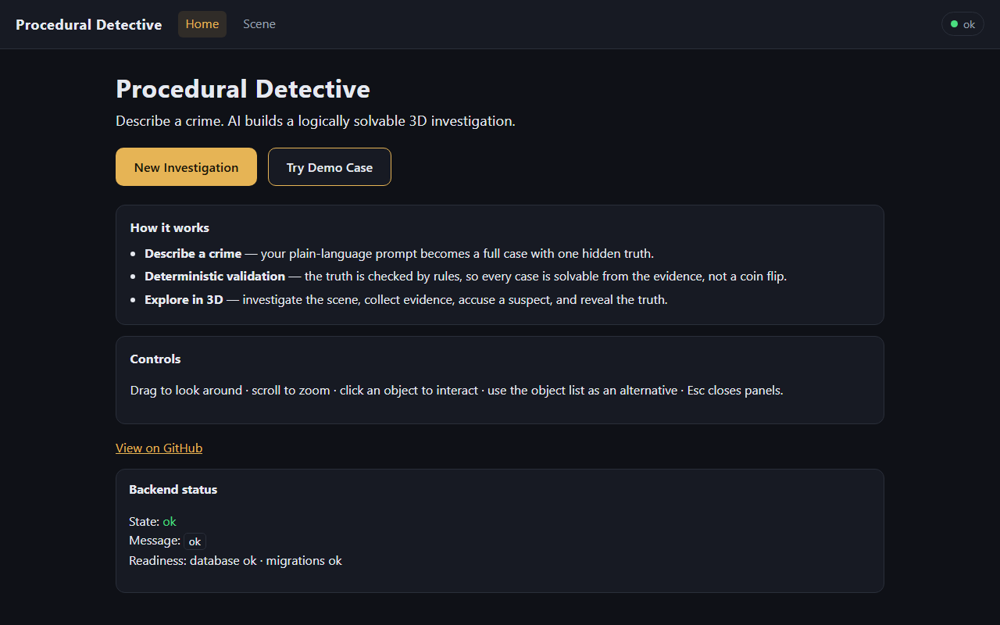
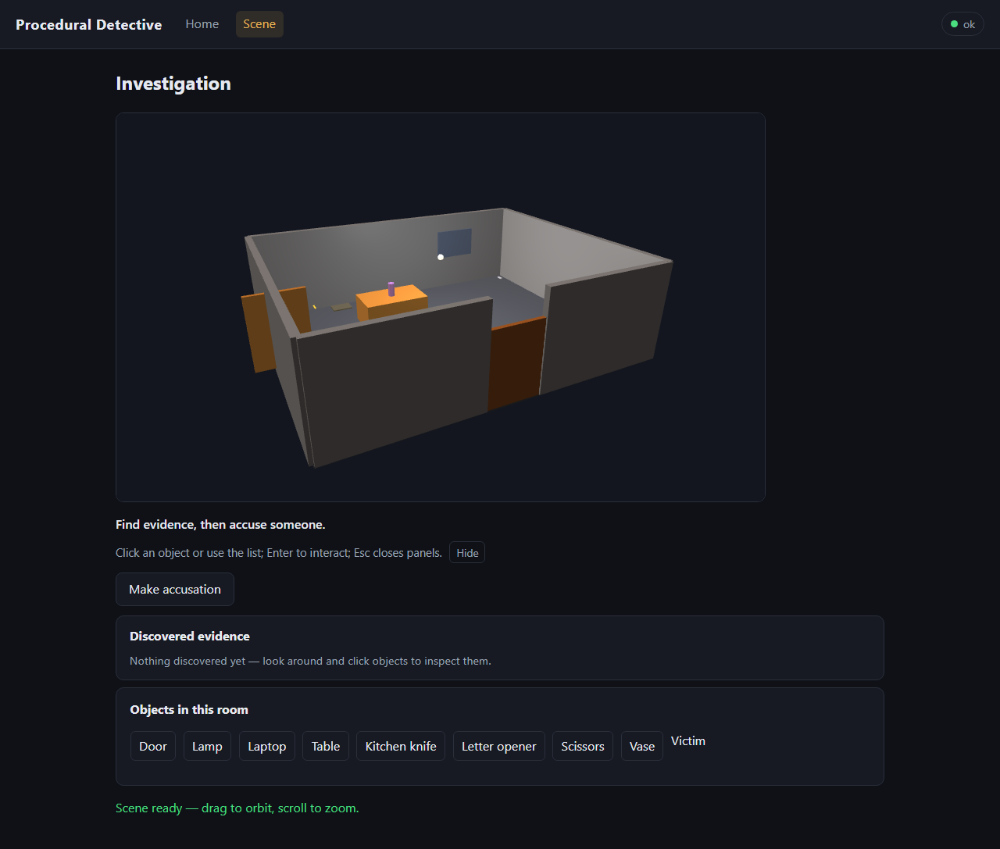
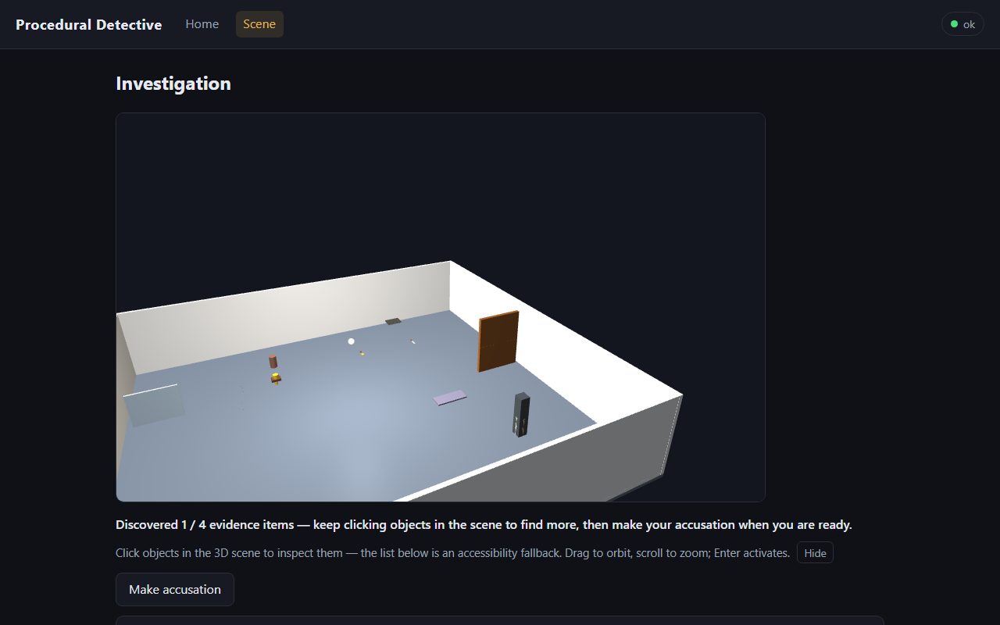
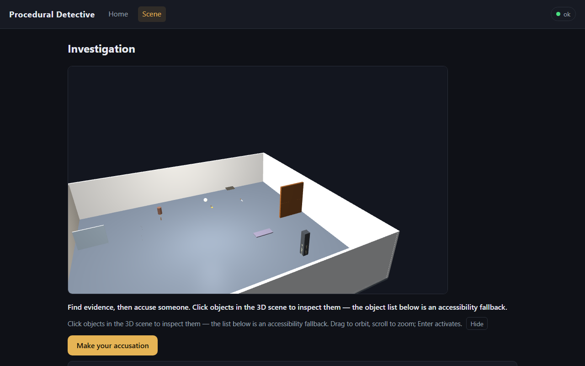
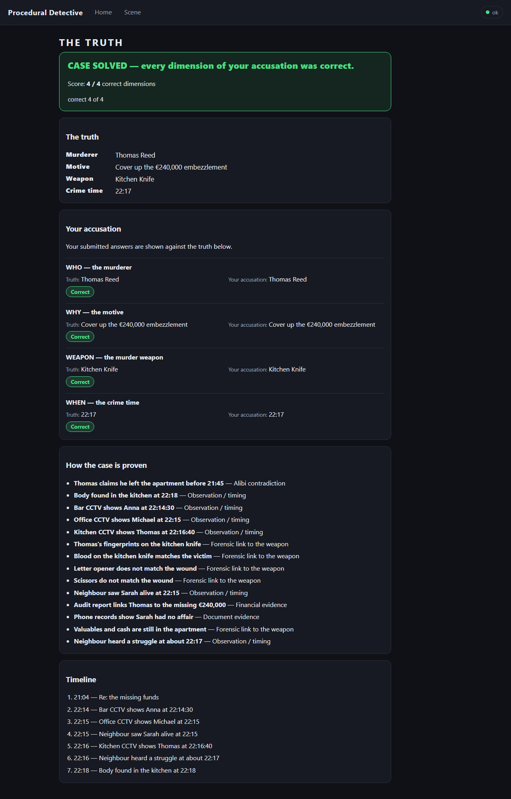

# Procedural Detective

**AI-native browser-based 3D detective game that turns natural-language crime prompts into logically consistent, interactive investigations.**

Describe a crime in plain language. Procedural Detective parses it into a hidden
ground truth, generates a coherent world of suspects, evidence and red herrings,
*makes sure the case is provably solvable* — then drops you into a 3D apartment
to investigate, accuse and reveal the truth.

---

## Screenshots

Captured evidence from the demo builds (`screenshots/evidence/`):







More evidence:

- Generation progress — `screenshots/evidence/phase8-generation-progress.png`,
  evidence inspection — `phase8-evidence-inspection.png`,
  accusation — `phase8-accusation-screen.png`
- The five environment kits: office `phase11-office-kit.png`,
  hotel suite `phase11-hotel-suite-kit.png`, warehouse `phase11-warehouse-kit.png`,
  mansion `phase11-mansion-kit.png`
- Different prompts, different worlds: `phase14-office-prompt-world.png`,
  `phase14-office-reveal.png`, `phase14-warehouse-reveal.png`,
  `phase14-mansion-prompt-world.png`
- Procedural object generation: `phase13-generated-object.png`,
  `phase145-unseen-object.png`, `phase12-critical-sheet.png`
- Judging polish: `phase81-hover-tooltip-direct.png`,
  `phase81-panel-knife.png`, `phase81-knife-opener-both.png`
- Local-AI (Ollama) mode: `phase16-ollama-selector.png`,
  `phase17cd-hermes-reveal-4of4.png`, `phase17-geometry-repaired.png`

## Try it

Two obvious paths (`GENERATION_PROVIDER=fake` is the default — deterministic,
zero credentials, zero cost):

- **Try Demo Case** — one click, runs the shipped showcase case immediately
  (`Victim: Sarah Miller / Murderer: Thomas Reed / Motive: €240,000
  embezzlement / Weapon: Kitchen knife / Time: 22:17 / Witness: Emily Reed`)
  and is labelled *"Deterministic demo — no API keys, no cost"*.
- **Generate a New Mystery** — the same generation journey from your own
  custom prompt (any text, difficulty optional). Watch the generation
  progress, then enter the 3D scene, inspect evidence, make an accusation
  (WHO / WHY / WEAPON / WHEN) and reveal the truth.

Both paths hit the exact same `POST /cases → progress → playthrough` journey.
The deterministic offline demo provider answers every prompt with the shipped,
fully validated golden case — zero credentials, zero cost (`LLM_API_KEY` etc.
are placeholders in `.env.example`, never real values). The frontend keeps the
UI honest about this: the generate path shows *"uses the built-in deterministic
generator in this demo build"* unless the SPA was built with
`VITE_APP_PROVIDER=live`, in which case it shows *"Live AI provider"* instead.
Plain prompts therefore produce the same deterministic case by default — to see
genuinely different worlds, enable local-AI mode (`GENERATION_PROVIDER=ollama`)
or live mode (`GENERATION_PROVIDER=live`), or use the documented showcase
prompts in `backend/tests/fixtures/world_showcase.py`.

## What to try first

Shortest judge path, no install:

```bash
.\scripts\start-demo.cmd      # (Windows) one command, opens the browser
```

1. Click **Try Demo Case** on the landing screen.
2. Inspect the 3D apartment, then **accuse** (WHO / WHY / WEAPON / WHEN).
3. Reveal — the case was provably solvable all along.

The whole thing takes under a minute. See "One-shot demo launcher" below for
options, or Docker / local setup for the other two ways to run it.

## Why this is different

Most AI "world generators" stop at impressive prose or pretty scenes. This game
adds the part AI is bad at: **objective validation**. The generated case must
pass a deterministic solver that proves, from the evidence a player can actually
discover, that there is exactly ONE solvable answer — murderer, motive, weapon
and time. If the generated world has no provable truth, it is never published.

## AI proposes, deterministic systems guarantee

> **AI can generate a world. Procedural Detective makes sure that world has a truth.**
>
> **Generated is not enough: every case is validated to have one answer.**

```text
Prompt
→ Truth & story generation
→ Asset Oracle
→ Environment + object resolution
→ Safe procedural asset generation when needed
→ World composition
→ Deterministic solvability validation
→ 3D investigation
```

A prompt first produces the immutable case truth (with the user's constraints
locked). The **Asset Oracle** then resolves every requested object and
environment against the bundled catalog and the five environment kits
(apartment, office, hotel suite, warehouse, mansion); when no catalog asset is a
sensible match it falls back to **safe procedural generation** (declarative
primitive compositions, no arbitrary geometry or scripts). The composed world
is validated by a **deterministic solver** that proves the case has exactly one
solvable answer from the discoverable evidence — and only then is it published
as a playable 3D investigation.

## Architecture overview

```text
            Browser (React / TypeScript / Babylon.js 3D)
                          │  REST (same-origin on :8000)
                          ▼
                    FastAPI backend
                          │
        ┌─────────────────┼──────────────────┐
        ▼                 ▼                  ▼
   Prompt → CaseTruth  Evidence/World    Deterministic
        │  (ground truth)  generation     VALIDATION
        │                 │               (unique-solution solver)
        ▼                 ▼                  ▼
        └───────── durable SQLite ──────────┘
                          │
                          ▼
        Player: investigate → accuse → reveal the immutable truth
```

One container serves the SPA **and** the API (single origin), with a durable
SQLite volume and migrations running automatically on startup. **Public
production is HTTPS-only**: a TLS edge (Caddy or your platform ingress)
fronts a private uvicorn backend — `:8000` is never exposed publicly, and the
frontend talks to the API same-origin at `/api/v1`. See `docs/DEPLOYMENT.md`.

## Safety and trust boundaries

- **Truth isolation** — CaseTruth never reaches the client before reveal. Every
  pre-reveal payload is an allowlisted DTO; the automated suite recursively
  scans every nesting level for hidden truth, solver internals and tokens.
- **Leak scanning** — the same scanners run as part of the test suite and the
  browser E2E specs (nothing hidden leaks into DOM, copy, or network).
- **Reveal gating** — `GET /playthroughs/{id}/reveal` is allowed only from
  `{ACCUSED, REVEALED}` (frozen REQUIREMENTS 40.12), transitions
  `ACCUSED → REVEALED` idempotently, and is served `Cache-Control: no-store`.
- **Solver independence** — deduction uses only the public case + discoverable
  evidence — never the hidden answer. A generated case is published only when
  exactly one survivor remains for every accusation dimension.
- The project runs an **adversarial, QA-gated engineering process with a
  closed-defect ledger at every gate** (independent adversarial review, QA-only
  defect closure, cumulative regression). Deployment specifics and the full
  security posture are in `docs/DEPLOYMENT.md`.

---

## Local setup

Requirements: Python 3.12+, Node 20+.

Run every backend command below from the **repo root** (paths like
`backend/...` are root-relative). A bare `cd backend` would make them fail
(`./backend[dev]`, `backend/alembic.ini` and the frontend path all resolve
differently from that directory).

```bash
# Backend (all from the REPO ROOT)
python -m pip install -e "./backend[dev]"
python -m alembic -c backend/alembic.ini upgrade head
python -m uvicorn app.main:app --host 127.0.0.1 --port 8000 --no-proxy-headers

# Frontend (second terminal, also from the REPO ROOT)
cd frontend
npm install
npm run dev        # http://localhost:5173
```

`--no-proxy-headers` is load-bearing: uvicorn's platform default trusts
loopback and would rewrite `request.client` from a spoofed `X-Forwarded-For`
before the app's rate-limit identity gate runs (DEF-094). The backend is the
only component that honors forwarded headers — and only when `TRUST_PROXY=true`
(see `docs/DEPLOYMENT.md` §7).

### Troubleshooting — "Demo errors" / "Try Demo Case fails"

1. **Generation dashboard shows a failure** — check the backend is up and its
   database is migrated:
   `http://127.0.0.1:8000/api/v1/readiness` should return
   `{"status":"ready","database":"ok","migrations":"ok"}`. If migrations are
   wrong or missing, run `python -m alembic -c backend/alembic.ini upgrade head`
   from the repo root, then restart uvicorn.
2. **Open the frontend at `http://localhost:5173`** — not `127.0.0.1:5173`.
   The default CORS allowlist is `http://localhost:5173`; requests from any
   other origin are rejected by the backend.
3. **Repeated quick demo re-runs can hit the in-memory global generation quota**
   (HTTP `429 ADMISSION_DENIED`) until the backend restarts. Restart uvicorn
   for a fresh demo window.

## One-shot demo launcher

The fastest way to play the demo is **one command** (Windows):

```bash
.\scripts\start-demo.cmd
```

or, from PowerShell:

```powershell
powershell -ExecutionPolicy Bypass -File scripts\start-demo.ps1
```

The launcher installs backend/frontend dependencies and builds the SPA only
when needed, applies database migrations, starts **ONE server** on
`http://localhost:8000` serving the built app **and** the API (single origin —
no CORS, no second terminal), and opens your browser. Press **Enter** (or
Ctrl+C) to stop it cleanly. The default `GENERATION_PROVIDER=fake` demo
provider needs no credentials (zero network, zero cost).

Options:

- `-NoBrowser` — do not open the browser automatically (for headless runs)
- `-Port <n>` — serve on a different port (default `8000`)
- `-Rebuild` — force a fresh `npm run build` of the frontend
- `-Stop` — stop the demo recorded in `<repo>\.pd-demo-meta`, then exit

If the port is already in use, the launcher prints a clear message and exits
`1` (run `.\scripts\stop-demo.ps1` first or pass `-Port <other>`). Stop a
running demo from another terminal with `.\scripts\stop-demo.ps1` (a safe
no-op when nothing is running). All launches/stops go through the repository's
identity-verified lifecycle guard (`tools/process_guard`), so no stray
listeners are left behind.

## Docker setup

```bash
docker compose up --build   # development — SPA + API on http://localhost:8000

# Production is HTTPS-only: TLS edge (Caddy) + private backend, no public :8000
CADDY_DOMAIN=detective.example.com CADDY_EMAIL=you@example.com \
  docker compose -f docker-compose.prod.yml up --build -d
```

The multi-stage image builds the frontend (Node 24) and the backend
(Python 3.12), runs as a non-root user, persists SQLite to the `pd-data`
volume, and runs `alembic upgrade head` before the server starts. See
`docs/DEPLOYMENT.md` for the full production configuration.

## Security & privacy

Public production is **HTTPS-only** with a **private uvicorn backend** —
production never publishes `:8000`; a Caddy TLS edge (or your platform
ingress) terminates TLS and the frontend reaches the API **same-origin** at
`/api/v1` (no absolute public API URL). Rate limiting, trusted-proxy and
production-profile guidance: `docs/DEPLOYMENT.md`.

**Privacy:** generated cases persist the raw prompt, public case, hidden
truth, generation metadata and player state in the private SQLite volume.
There is **no automatic deletion** — data is retained for the demo period and
then deleted by the operator. Policy + operator deletion/backup procedures:
`docs/PRIVACY.md`.

## Environment configuration

Copy `.env.example` to `.env` — it documents every canonical variable
(REQUIREMENTS §45). Key variables:

| Variable | Purpose | Default |
| --- | --- | --- |
| `DATABASE_URL` | SQLAlchemy URL | `sqlite:///<repo>/procedural_detective.db` (local) / `sqlite:////data/procedural_detective.db` (container) |
| `GENERATION_PROVIDER` | `fake` demo, `ollama` local AI, or `live` LLM | `fake` |
| `LLM_API_KEY` / `LLM_MODEL` / `LIVE_PROVIDER_URL` | live-mode credentials (never committed) | unset |
| `OLLAMA_BASE_URL` / `OLLAMA_MODEL` | local-AI mode (Ollama) | `http://127.0.0.1:11434` / `llama3.2:3b` |
| `CORS_ALLOWED_ORIGINS` | comma-separated allowlist (`*`/`null` rejected) | `http://localhost:5173` |
| `MAX_*`, `*_TTL_SECONDS` | generation budgets, token TTLs | see `.env.example` |
| `STATIC_DIR` | built frontend directory (SPA serving) | `/app/static` (container) |

## Testing

```bash
# Backend suite (~600 tests): domain solvers, generation lifecycle, API
# contracts, authorization/isolation, leak scanners, cache-safety & deployment polish
cd backend && python -m pytest -q

# Root tooling suite (50 tests + adapter-drift check)
python -m pytest tests/ -q
python tools/generate_adapters.py --check --all

# Frontend (owned by the parallel UI track)
cd frontend && npm test && npm run typecheck && npm run build

# End-to-end Playwright specs (e2e/)
#   boot.spec.ts — landing → prompt → generation → investigation
#   investigation-golden.spec.ts — knife/laptop/email discovery in the 3D scene
#   accusation-reveal-golden.spec.ts — accusation → reveal → reload persistence
#   backend-down.spec.ts / degraded.spec.ts — graceful degraded behavior
```

## Tech stack

- **Backend:** Python 3.12 · FastAPI · Pydantic v2 · SQLAlchemy 2 · Alembic · SQLite
- **Frontend:** React · TypeScript · Vite · Babylon.js (3D)
- **Testing:** pytest (backend) · Vitest (frontend) · Playwright (browser E2E)
- **Deployment:** Docker (multi-stage, non-root, SQLite volume)

## Hackathon context

Built for the **Victoria VR AI Builder Hackathon 2026** as Milestone 1: a
complete, reliable prompt-to-truth player journey with deployment and demo
assets — no VR required to play.

Repository: <https://github.com/DaveKingBerlin/procedural-detective>

## Hosted demo

*Hosted demo URL lands here after hosting is chosen.* The deployment is a
single container — see `docs/DEPLOYMENT.md` for the guide.

## Demo video

*Under-3-minute demo video lands here after recording (hosting-dependent).*
Storyboard: `docs/demo-storyboard.md`.